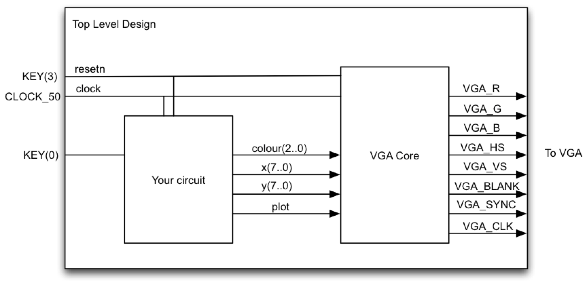

# Lab 2: Circles and Triangles

## Contents

* [Overview](#overview)
* [External IP](#external-ip)
  * [Task 1: Understanding the VGA adapter core](#task-1-understanding-the-vga-adapter-core)
* [Design](#design)
  * [Task 2: Fill the Screen](#task-2-fill-the-screen)
  * [Task 3: Bresenham Circle Algorithm](#task-3-bresenham-circle-algorithm)
  * [Task 4: The Reuleaux triangle](#task-4-the-reuleaux-triangle)
  * [Bonus task: Bounce\!](#bonus-task-bounce)
* [Deliverables and Evaluation](#deliverables-and-evaluation)


## Overview

In this lab, you will get more experience creating datapaths and state machines. You will also learn how to use an embedded VGA adapter core that we will give you to draw images on the screen.

The top level diagram of your lab is shown below. The VGA Core is the part given to you, so all the excitement will be in the block labeled “your circuit.”

<p align="center"></p>

## External IP

In the digital design industry, most designs incorporate modules provided by another team or another company. In this lab, we provide you with a VGA adapter module that converts a framebuffer view of the screen to the actual signals expected on the physical VGA port.

### Task 1: Understanding the VGA adapter core

The VGA adapter was created at the University of Toronto for a course similar to CPEN 311. The description below is enough for you to use the core, but you can find the complete specification at [the original site](http://www.eecg.utoronto.ca/~jayar/ece241_07F/vga). Some of the following figures have been taken with permission from that website (with permission.

The VGA adapter has been set up to display a grid of 160×120 pixels, only _slightly_ worse than the [Atari 2600](https://en.wikipedia.org/wiki/Atari_2600_hardware). The interface is as shown below:

<p align="center"></p>

| Signal | Direction | Semantics |
| --- | --- | --- |
| resetn      | input  | active-low reset |
| colour[2:0] | input  | pixel colour (3 bits), each bit indicating the presence of one of the RGB components |
| x[7:0]      | input  | x coordinate of pixel to be drawn (0 ≤ x < 160) |
| y[6:0]      | input  | x coordinate of pixel to be drawn (0 ≤ x < 120) |
| plot        | input  | active-high plot enable signal |
| VGA_CLK     | output | VGA clock (25 MHz) |
| VGA_R[9:0]  | output | VGA red component |
| VGA_G[9:0]  | output | VGA green component |
| VGA_B[9:0]  | output | VGA blue component |
| VGA_HS      | output | VGA horizontal sync |
| VGA_VS      | output | VGA vertical sync |
| VGA_SYNC    | output | VGA special synchronization mode |
| VGA_BLANK   | output | VGA special blank mode |

You will connect all outputs of the VGA core directly to the appropriate output pins of the FPGA.

You can picture the VGA pixel grid as shown below. The (_x_,_y_) position (0,0) is located on the top-left corner and (159,119) is at the other extreme end.

<p align="center"></p>

To turn on a pixel, you drive the _x_ input with the x position of the pixel, drive the _y_ input with the y position of the pixel, and _colour_ with the colour you wish to use. You then raise the _plot_ signal. At the next rising clock edge, the pixel turns on. In the following timing diagram, two pixels are turned on: one at (15, 62) and the other at (109,12). As you can see, the first pixel drawn is red and is placed at (15, 62), while the second is a yellow pixel at (109, 12). It is important to note that, at most, one pixel can be turned on each cycle — thus, if you want to turn on _m_ pixels, you need _m_ cycles.

<p align="center"></p>

The source code for the VGA adapter is in the `vga-core` folder in this repository.

To help you understand the interface, we have created a `vga_demo.sv` file which connects the core I/O to switches on the DE1-SoC so you can experiment. We suggest you understand this module and try it out to make sure you understand how the inputs of the core work. (Note that you will not use this file for the other tasks in this Lab.)

#### VGA bus widths on the DE1-SoC and DE0-CV

The VGA module we have provided has 10 bits of precision for the VGA red, green, and blue component signals. The DE1-SoC FPGA board we are using, though, has a DAC with only has 8 bits of precision for the same signals (you can see this in the pin assignment file). This means that you need to take the 8 most significant bits output by the VGA adapter module to drive the board outputs. (If you are using the DE0-CV, the DAC is even more primitive and only has 4 bits of precision for the three signals.)

#### Simulation with the VGA core

Having this kind of external IP can make simulation inconvenient — it will produce some signals on the VGA sync and RGB outputs, but it would be a bit messy interpret them as pixels.

To make your life easier, we have provided two examples you could start from in folder `vga-hacks`:

- file `vga_adapter_sim.sv` implements a fake VGA adapter that prints the plot commands you send to the VGA module
- files `vga_adapter_window.sv` and `vga_window.tcl` implement a fake VGA adapter that also plots your commands in a GUI window

To use either of them, compile either `.sv` file instead of `vga_adapter.v` as part of your design (the module name and interface are the same). To use the GUI hack, you will first have to load the TCL script `vga_window.tcl` by executing

```TCL
source vga_window.tcl
```

in the ModelSim command window. Feel free to modify these as you see fit, but you **must not** depend on the modifications in your design and testbench — the autograder will use its own “fake” implementation of the VGA adapter.


## Design

### Task 2: Fill the Screen

You will first create a simple circuit that fills the screen. Each column will be a different colour (repeating every 8 columns). Remember that you can only turn on one pixel at a time, so you would need an algorithm similar to this pseudocode:

    for x = 0 to 159:
        for y = 0 to 119:
            turn on pixel (x, y) with colour (x mod 8)

You are to create a circuit that implements the above algorithm. A skeleton file `fillscreen.sv`, and a top-level skeleton `task2.sv`, are in the task2 folder.

The interface to the `fillscreen` module is as follows:

| Signal | Direction | Semantics |
| --- | --- | --- |
| clk       | input  | clock |
| rst_n      | input  | active-low _asynchronous_ reset |
| colour    | input  | fill colour (ignored for Task 2) |
| start     | input  | assert to start filling the screen |
| done      | output | goes high once the entire screen is filled |
| vga_*     | output | outputs to the VGA adapter module |

The user of your module will assert `start` and hold it high until your module asserts `done`. You will need to ignore the `colour` input for Task 2, but it will be useful for the later tasks.

The `task2` module is the toplevel module you will load into the FPGA. It should instantiate the VGA adapter and your `fillscreen` module, and fill the entire screen with the colour stripes on reset. This must be finished in 19,210 cycles of CLOCK_50 from the time the reset is _deasserted_, i.e., one cycle per screen pixel plus 10 extra cycles; you will need to assert `done` at some point within that time budget.

Exhaustively test your design by writing a testbench and simulating everything in ModelSim (hint: look at the counters first). You will need to demonstrate and submit comprehensive testbenches both for the fillscreen module and the toplevel module.

Next, try your design out on your FPGA board. You will need a VGA cable and a VGA-capable display; in the MCLD labs, a VGA cable and LCD display are provided.

Make sure your pixel colours are correct. The autograder will compare them against the reference solution.


### Task 3: Bresenham Circle Algorithm

The Bresenham Circle algorithm is an integer-only circle-drawing algorithm. The basic algorithm is described in the following pseudocode (modified from Wikipedia):

    draw_circle(centre_x, centre_y, radius):
        offset_y = 0
        offset_x = radius
        crit = 1 - radius
        while offset_y ≤ offset_x:
            setPixel(centre_x + offset_x, centre_y + offset_y)   -- octant 1
            setPixel(centre_x + offset_y, centre_y + offset_x)   -- octant 2
            setPixel(centre_x - offset_x, centre_y + offset_y)   -- octant 4
            setPixel(centre_x - offset_y, centre_y + offset_x)   -- octant 3
            setPixel(centre_x - offset_x, centre_y - offset_y)   -- octant 5
            setPixel(centre_x - offset_y, centre_y - offset_x)   -- octant 6
            setPixel(centre_x + offset_x, centre_y - offset_y)   -- octant 7
            setPixel(centre_x + offset_y, centre_y - offset_x)   -- octant 8
            offset_y = offset_y + 1
            if crit ≤ 0:
                crit = crit + 2 * offset_y + 1
            else:
                offset_x = offset_x - 1
                crit = crit + 2 * (offset_y - offset_x) + 1

In this task, you are to implement a circuit that draws a circle with its centre at specified coordinates, a specified radius, and a specified colour. The interface to this `circle` module is as follows:

| Signal | Direction | Semantics |
| --- | --- | --- |
| clk       | input  | clock |
| rst_n      | input  | active-low _asynchronous_ reset |
| colour    | input  | drawing colour |
| centre_x  | input  | the x-coordinate of the centre |
| centre_y  | input  | the y-coordinate of the centre |
| radius    | input  | the radius in pixels |
| start     | input  | assert to start filling the screen |
| done      | output | goes high once the entire circle is drawn |
| vga_*     | output | outputs to the VGA adapter module |

As with the `fillscreen` module, we will assert `start` and hold it high until your module asserts `done`.

Your `circle` module must work for _any_ centre and radius inputs, _including_ centres and radii where parts of the circle would be off the screen (in which case you must draw only the on-screen parts). As we discussed in lecture, you can do this by refining your datapath from Task 2.

The clock cycle budget you have for `circle` the number of pixels that are actually drawn for the circle in the specified colour, plus 10 extra cycles. You must assert `done` within the cycle budget to receive full credit.

The top-level module `task3` will, on reset, clear the screen to black, and draw a green circle with the centre at (80,60) and a radius of 40. This is what you will demo. The clock cycle budget is 19,200 plus your `circle` budget plus 10.

In designing the datapath for this algorithm, remember that you can only update one pixel per clock cycle. This means that each iteration through the loop will take at least 8 clock cycles (since you are updating 8 pixels per iteration).

Note that you are using CLOCK_50, the 50Mhz clock, to clock your circuit. This is different than Lab 1 where you used a pushbutton switch for your clock.

As before, you will need to demonstrate and submit comprehensive testbenches both for the circle module and the toplevel module.

Be especially careful that your pixel positions are correct. The autograder will compare the pixels you output against the reference solution, looking for pixels that overlap, extra pixels, and missing pixels. If you draw a circle in a different place than requested or with an incorrect radius, it is not likely that many pixels will overlap.


### Task 4: The Reuleaux triangle

This task requires you to draw a [Reuleaux triangle](https://en.wikipedia.org/wiki/Reuleaux_triangle). This is a figure similar to a chubby equilateral triangle, where each triangle side is replaced by a section of a circle centred at the opposite corner:

<p align="center"></p>

You can think of this figure as the boundary of the intersection of three circles like this:

<p align="center"></p>

For the Reuleaux triangle, the _centre_ is defined as the point equidistant from all three corners, while the _diameter_ is defined as usual as any segment that passes through the centre and whose endpoints lie on the Reuleaux triangle. This diameter is the same as the length of one side of the inscribed triangle, and the same as the _radius_ of the three circles used to construct it.

Your job is to write a module which draws this figure with the centre coordinates and the diameter as inputs (pointy end up, as in the figures above). You might want to use your circle design and carefully control when the pixels are drawn.

The interface for module `reuleaux` is the same as the one for `circle` from Task 3, except we specify the _diameter_ of the Reuleaux triangle instead of the radius of the circle.

Your cycle budget is the number of cycles that would be required to fully draw all three circles used to construct the Reuleaux triangle, plus 15 cycles; the `done` signal that indicates you are finished must be asserted within this budget. (Note that this is _a lot_ more than is needed to draw the actual triangle; you might want to think about how you would do it without wasting cycles on pixels you never draw.)

At the demo stage you will need to clear the screen to black, and draw a green Reuleaux triangle with the centre at (80,60) and a diameter of 80, so that is what your top-level module `task4` must do on reset. The cycle budget is 19,200 plus your `reuleaux` budget, plus 10 cycles.

As before, you will need to demonstrate and submit comprehensive testbenches both for the reuleaux module and the toplevel module.

Be especially careful that your pixel positions are correct. As with the circle task, the autograder will compare pixel positions against a reference solution.


### Bonus task: Bounce!

For some bonus credit, you can animate your circle bouncing around the screen.

On reset, the toplevel `ball.sv` must clear the screen, draw a circle and draw a circle at (80,60) with radius 20, and start moving it at a 45° angle towards the upper right quadrant. The circle should bounce off all the screen edges as if they were solid walls without losing any momentum (i.e., elastic collision): that is, it should come as close as possible, but no pixels of the circle should be ever outside of the screen.

You may earn additional bonus credit if you correctly implement several balls bouncing off the walls _and each other_ (again, elastic collision), in `balls.sv`. The number of balls on the screen should be configurable by setting SW [2:0] to the desired # of balls (i.e., up to 8 balls) and resetting. The balls must be able to travel at any angle (not just 45°) and bounce off each other at correct angles even if they do not hit each other head-on (like in a game of pool). Your initial ball position choices must demonstrate this.

This task will be marked exclusively by the TA during your lab demo. However, you are **required** to submit your design source files as well as your testbenches to GitHub, or your bonus score may be disqualified.


## Deliverables and Evaluation

### Automatic testing

We will be marking your code via an automatic testing infrastructure. Your autograder marks will depend on the fraction of the testcases your code passed (i.e., which features work as specified), and how many cases your testbenches cover.

It is essential that you understand how this works so that you submit the correct files — if our testsuite is unable to compile and test your code, you will not receive marks.

The testsuite evaluates each task separately. For each design task folder (e.g., `task4`), it collects all Verilog files (`*.sv`) that do not begin with `tb_` and compiles them **all together**. Separately, each required `tb_*.sv` file is compiled with the relevant `*.sv` design files. This means that

1. You must not **rename any files** we have provided.
1. Your testbench files must begin with `tb_` and **correspond to design file names** (e.g., `tb_foo.sv` for design `foo.sv`).
1. You must not have **multiple copies of the same module** in separate committed source files in the same task folder. This will cause the compiler to fail because of duplicate module definitions.
1. Your modules must not **rely on files from another folder** with the exception of the VGA modules. The autograder will only look in the relevant task folder, and will have its own version of the VGA modules.
1. You must not copy the VGA files into the task folders; this will conflict with the autograder's custom VGA module.

The autograder will instantiate and test each module exactly the way it is defined in the provided skeleton files. This means that
1. You must not **alter the module declarations, port lists, etc.**, in the provided skeleton files.
1. You must not **rename any modules, ports, or signals** in the provided skeleton files.
1. You must not **alter the width or polarity of any signal** in the skeleton files (e.g., everything depending on the clock is posedge-triggered, and `rst_n` must remain active-low).

If your code does not compile and simulate under these conditions (e.g., because of syntax errors, misconnected ports, or missing files), you will receive **0 marks**. If your code does not synthesize using Quartus, your marks will be reduced.


### Marks

The evaluation of your submission consists of two parts:
- the TA demo, worth 30%, and
- the autograder tests of your code and testbenches, worth 70%

(The bonus task is scored differently; see below).


### Task 1

No deliverables.


### Task 2 [1 mark]

Deliverables in folder `task2`:

- Modified `task2.sv` (the toplevel)
- Modified `fillscreen.sv`
- Modified `tb_task2.sv` (the toplevel)
- Modified `tb_fillscreen.sv`
- Any other modified/added source/testbench files for your design


### Task 3 [4 marks]

Deliverables in folder `task3`:

- Modified `task3.sv` (the toplevel)
- Modified `circle.sv`
- Modified `tb_task3.sv` (the toplevel)
- Modified `tb_circle.sv`
- Any other modified/added source/testbench files for your design


### Task 4 [5 marks]

Deliverables in folder `task4`:

- Modified `task4.sv` (the toplevel)
- Modified `reuleaux.sv`
- Modified `tb_task4.sv` (the toplevel)
- Modified `tb_reuleaux.sv`
- Any other modified/added source/testbench files for your design


### Bonus [1+ bonus mark]

Deliverables in folder `bonus`:

- Modified `ball.sv` (the toplevel for the single-circle case)
- Modified `balls.sv` (the toplevel for the multi-circle case)
- Any other modified/added source/testbench files for your design

Your bonus score will be determined by the TA during your demo. To be eligible for this credit, however, you must submit all of your source and testbench files, and they must reproduce the behaviour you demoed once synthesized and loaded into the FPGA.
